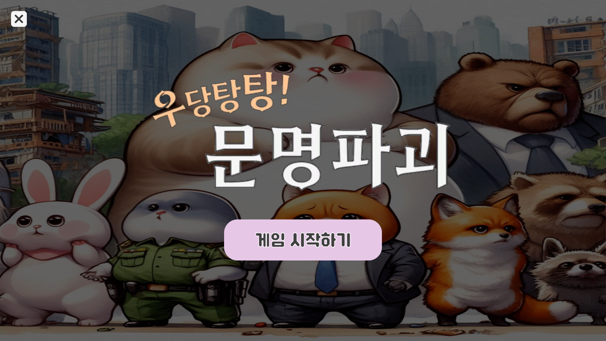
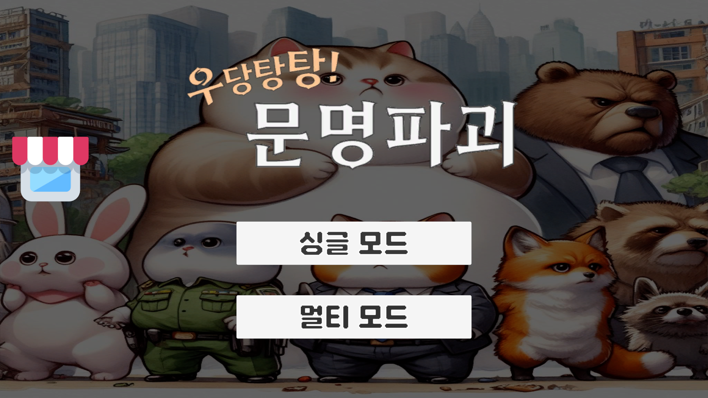
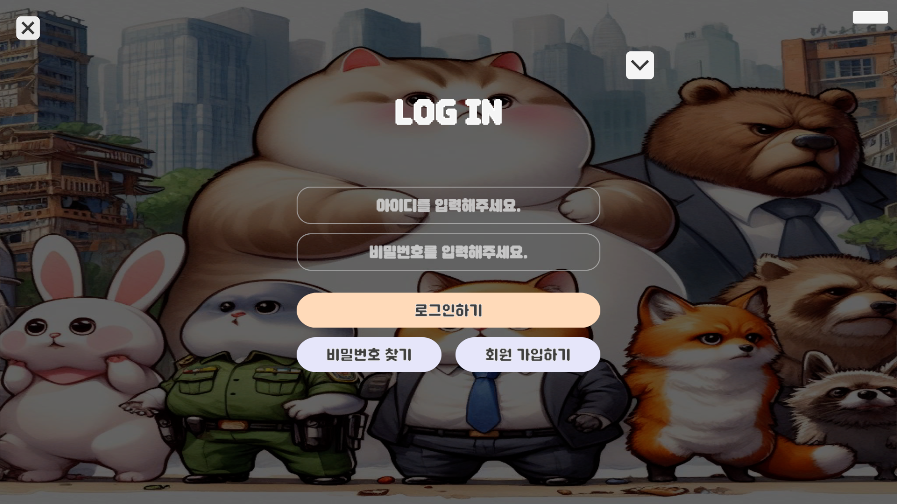
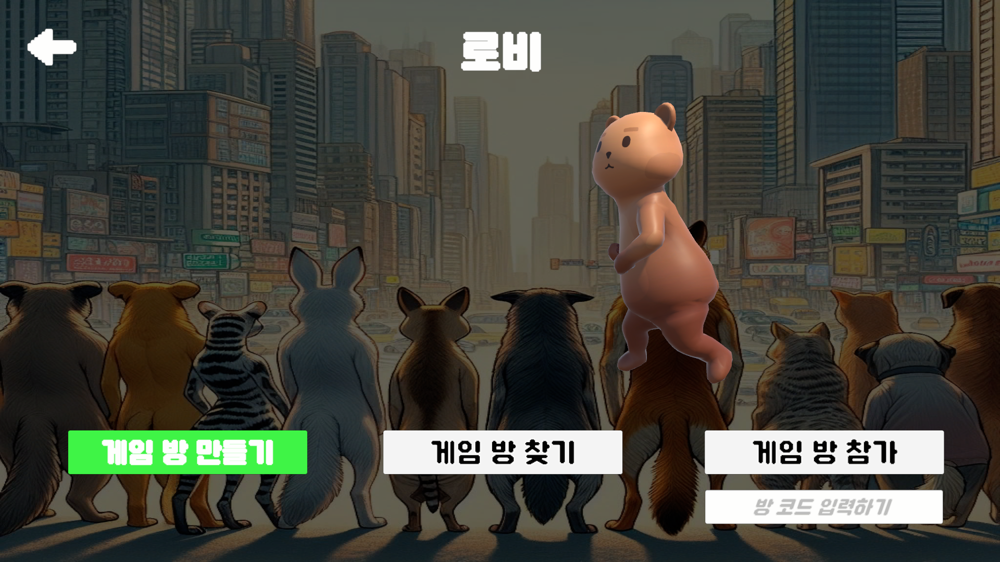
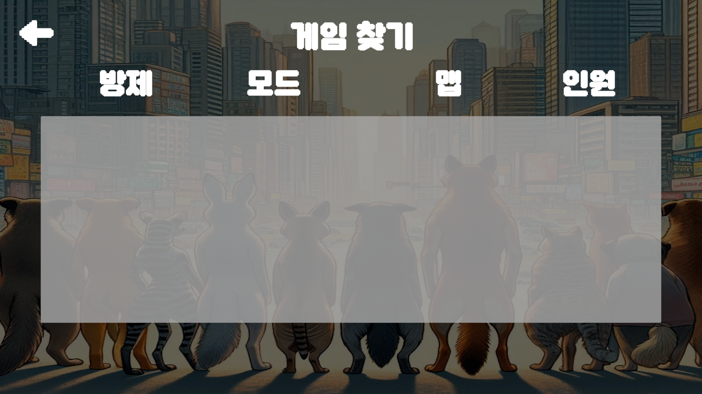
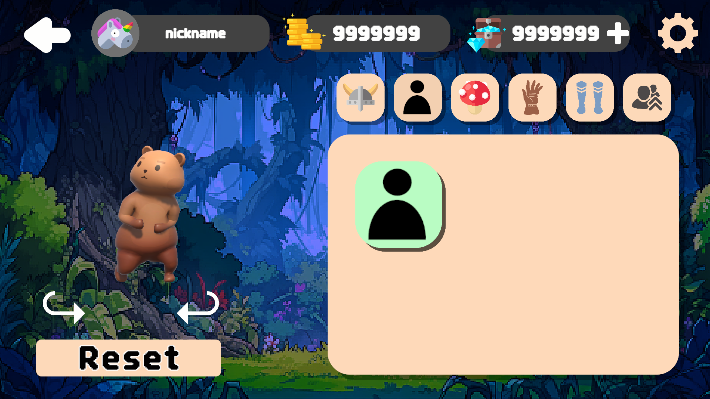
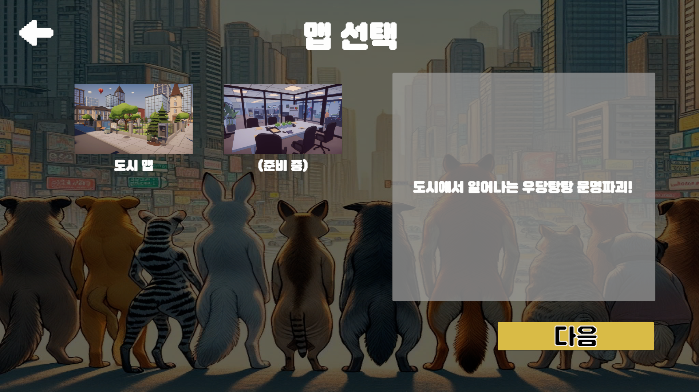
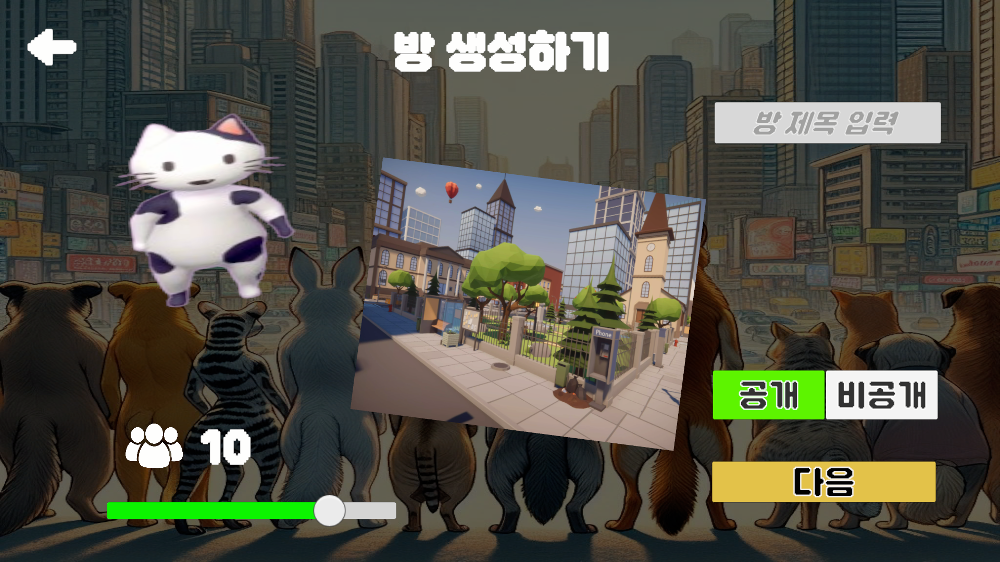

# 부릉부릉! 문명파괴 - 3D 마피아 게임
   <br>
>  링크  👉 

## 목차
1. [개요](#개요)
2. [주요 기능](#주요-기능)
3. [개발 환경](#개발-환경)
4. [프로젝트 파일 구조](#프로젝트-파일-구조)
5. [기술 소개](#기술-소개)
6. [서비스 화면](#서비스-화면)
7. [팀원 소개](#팀원-소개)

## 개요
### 시나리오
막대한 빌딩들이 솟아나고, 끊임없이 확장되는 도시.<br>
빠른 속도로 성장하는 공장에서는 매연과 폐수를 뿜어내고 있다.<br>
점점 파괴되는 자연에 야생동물들은 터전을 잃어가고 있는데..<br>

**“우리들의 터전을 지키기 위해선 인간들의 개발을 막아야만 해!”**


**~~“나를 길러준 인간들을 위해 야생동물들의 방해공작을 저지해야 한다!”~~**
**“진작 인간 편에 붙지 않은 멍청한 야생동물이 훼방놓게 할 수 없지!”**


생김새로는 구분할 수 없는 야생동물과 스파이 동물의 치열한 심리전!!


***우리 터전은 우리가 지킨다!***

### 컨셉
**인간들의 문명에 의해 터전을 잃어가는 ‘야생동물’팀 (시민 역할) vs 인간에게 훈련된 ‘스파이동물’팀 (마피아 역할)**

이러한 두 팀으로 나눠져서 진행되는 마피아 게임입니다.

플레이어는 로비에서 정해진 동물 캐릭터 중 하나를 선택하여 플레이합니다.

게임을 시작하면 로비에 있던 플레이어 중 몇 명이 랜덤하게 애완동물 역할로 배정되고, 

나머지 인원은 야생동물 역할로 배정됩니다. 

모든 플레이어는 직업이라고 하는 특수 능력을 가지고 있습니다.

각자 플레이어들은 역할에 맞는 조건을 달성해야 승리하는 게임입니다.

### 게임 룰
#### 승리 조건
- 야생동물 팀의 승리 조건은 다음 중 하나를 만족해야 합니다.

1. 자연 파괴 방해공작(건축물 파괴 등의 상호작용/장부 불에 태우기/배선 자르기 )을 성공시켜 미션 진행도를 100%로 만듭니다. 
2. 애완동물 팀 인원을 모두 검거해야 합니다.

애완동물을 검거하는 방법은 투표에서 과반수 이상의 표를 받았을 때 성사됩니다.

- 애완동물 팀의 승리 조건은 다음을 만족해야 합니다.
1. 야생동물보다 남은 인원수가 많아야 합니다.
2. 끝까지 살아남아야 합니다.

투표는 맵 중앙에 있는 투표 소집을 누르거나, 애완동물에게 저지당해 기절한 동물을 통해 1회에 한해 진행됩니다.

애완동물 팀의 승리 조건은 최소 1명 이상이 야생동물 플레이어에게 검거되지 않고, 모든 야생동물을 저지하는 것입니다.

## 주요 기능
### 

## 개발 환경

<p align="center">
  <b>Front</b> <br>
  
  
</p>

<p align="center">
  <b>Backend</b> <br>
  
  
  
</p>

<p align="center">
  <b>Management Tool</b> <br>
  
  
  
  
  
</p>

<!-- ## 프로젝트 파일 구조
├─ | └─
### Front-end
```
```

### Back-end
```
``` -->

## 서비스 화면
### 메인 화면


### 모드 선택 화면


### 로그인 화면


### 로비 화면


### 방 찾기 화면


### 상점 화면


### 방 생성 화면 - 맵 선택


### 방 생성 화면 - 모드 선택


### 방 생성 화면 - 설정 선택


## 설계 문서
- [기능/요구사항 명세서]()
- [API]()
- [컨벤션]()
- [기획서]()
- [ERD]()
- [Components]()

## 팀원 소개
- 김수현 (팀장)
- 정원종 (Unity)
- 전소현 (Unity)
- 이준혁 (Unity)
- 송동호 (Unity)
- 백현우 (백엔드)
